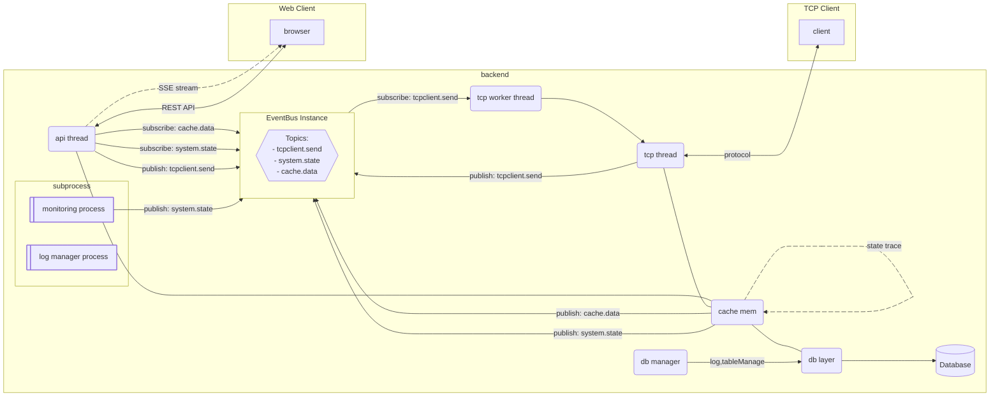

# app-folder-template

I want to manage and handle the project more efficiently by standardizing the app folder structure. By doing so, I aim to help others easily understand and work with the system.

++ examples using gorilla no longer be writed. reference the gin folder

```
pjt/
├── cmd/              # 애플리케이션 엔트리 포인트
│   └── server/
│       ├── log/
│       └── env.ini
├── internal/         # 애플리케이션 내부 코드
│   ├── logger/       # 커스텀 로거
│   ├── config/       # 설정
│   ├── container/    # 의존성 컨테이너
│   ├── app/          # 애플리케이션 시작/종료 로직
│   ├── service/      # 비즈니스 로직
│   ├── eventbus/     # 이벤트 버스
│   ├── healthcheck/  # 시스템 헬스 체크
│   ├── db/           # 데이터 접근 계층
│   │   ├── entity/
│   │   └── db-handler/
│   ├── transport/    # 실행 프로세스 관련 코드
│   │   ├── http/
│   │   └── tcp/
│   └── infra/        # 메모리 관련 코드
│       ├── cache/
│       └── object/
└── pkg/              # 외부 라이브러리 코드
```

## architecture

