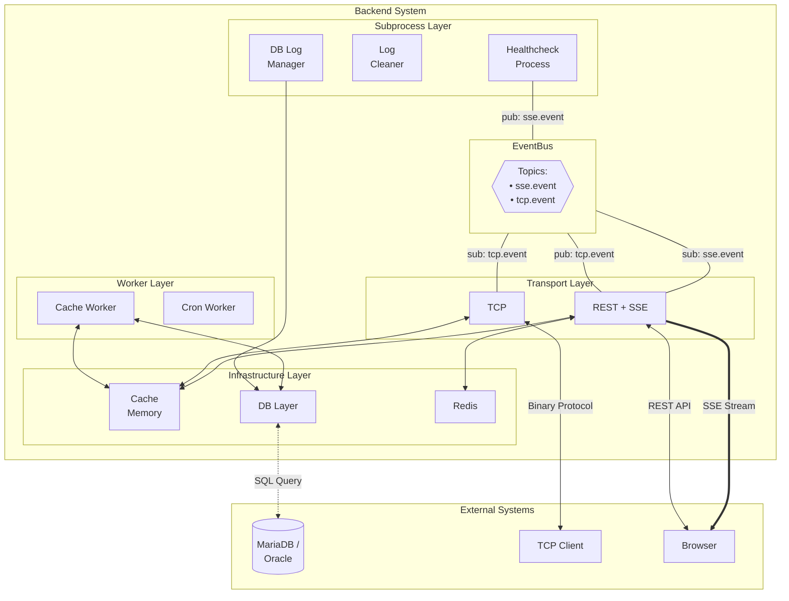

# app-folder-template

REST/SSE + TCP 이중 전송, 인메모리 캐시, 다중 DB를 지원하는 백엔드 애플리케이션 폴더 구조 템플릿입니다.
동일한 아키텍처를 Go, Java, C++로 각각 구현하여, 언어별 관용 표현의 차이를 비교할 수 있도록 구성했습니다.

## 폴더 구조

```
app-folder-template/
├── go/
│   ├── gin/                 # ✅ Go 구현체 (Gin 프레임워크)
│   └── gorilla/             # ❌ Deprecated (이전 버전)
├── java/
│   └── springboot/          # ✅ Java 구현체 (Spring Boot 3.5)
└── c++/
    └── drogon/              # ✅ C++ 구현체 (Drogon + Asio)
```

## 공통 아키텍처

세 구현체 모두 동일한 계층 구조와 컴포넌트를 따릅니다.

### 계층 구조

| 계층 | Go (`go/gin/`) | Java (`java/springboot/`) | C++ (`c++/drogon/`) | 역할 |
|------|----------------|---------------------------|---------------------|------|
| 진입점 | `cmd/server/main.go` | `AppfolderApplication.java` | `cmd/server/main.cpp` | 앱 시작 |
| DI 컨테이너 | `container/container.go` | `config/*.java` (@Configuration) | `container/container.cpp` | 의존성 조립 |
| 생명주기 | `app/app.go` | `app/AppLifecycle.java` | `app/app.cpp` | 시작/종료 순서 관리 |
| REST/SSE | `transport/http-rest/` (Gin) | `transport/http/` (Spring MVC) | `transport/http_rest/` (Drogon) | HTTP API + 실시간 스트리밍 |
| TCP | `transport/tcp/` | `transport/tcp/` | `transport/tcp/` (Asio) | 바이너리 프로토콜 통신 |
| 서비스 | `service/` | `service/` | `service/` | 비즈니스 로직 |
| DB | `db/db-handler/` | `db/handler/` | `db/db_handler/` (SOCI) | 다중 DB 추상화 (MariaDB, Oracle) |
| 캐시 | `infra/cache/` | `infra/cache/` | `infra/cache/` | 인메모리 캐시 |
| 이벤트 | EventBus (외부 모듈) | `eventbus/EventBus.java` | `event/event_bus.cpp` | 내부 메시지 브로커 |
| 워커 | `worker/` | `worker/` | `worker/` | 백그라운드 작업 (캐시 동기화, 크론) |

### 핵심 컴포넌트

- **REST/SSE 서버**: HTTP API 엔드포인트 + SSE를 통한 실시간 이벤트 스트리밍
- **TCP 서버**: 커스텀 바이너리 프로토콜 기반 양방향 통신
- **EventBus**: 컴포넌트 간 비동기 메시지 전달 (REST → TCP, 캐시 → SSE 등)
- **인메모리 캐시**: 시작 시 DB에서 로드, CacheWorker가 주기적으로 동기화
- **다중 DB 지원**: 인터페이스 기반 추상화로 드라이버 교체 가능
- **JWT 인증**: HTTP-only 쿠키 기반 인증

### 아키텍처 다이어그램



## Go 구현체 (`go/gin/`)

Gin 프레임워크 기반. 고루틴을 사용한 경량 동시성 모델.

### 빠른 시작

```bash
cd go/gin/cmd/server
# env.ini 설정 후
go run main.go
```

### 주요 커맨드

```bash
cd go/gin

# 서버 실행 (반드시 cmd/server/에서)
cd cmd/server && go run main.go

# 바이너리 빌드
cd cmd/server && go build -o ./main main.go

# Docker 이미지 빌드
./docker_build.sh

# 전체 테스트
go test ./...
```

### 설정

`cmd/server/env.ini`에서 설정. `[DB] TYPE` 키로 드라이버 선택: `oracle`, `maria`, `mysql`, `postgres`, `tibero`

자세한 내용은 [`go/README.md`](go/README.md) 참조.

## Java 구현체 (`java/springboot/`)

Spring Boot 3.5 / Java 17 기반. 스레드 풀을 사용한 동시성 모델 (Java 21+에서 가상 스레드로 전환 가능).

### 빠른 시작

```bash
cd java/springboot/appfolder
# application.properties 설정 후
./gradlew bootRun
```

### 주요 커맨드

```bash
cd java/springboot/appfolder

# 개발 서버 실행
./gradlew bootRun

# JAR 빌드
./gradlew build

# JAR 실행
java -jar build/libs/appfolder-0.0.1-SNAPSHOT.jar

# 전체 테스트
./gradlew test
```

### 설정

`src/main/resources/application.properties`에서 설정. `db.type`으로 드라이버 선택: `maria` 또는 `oracle`

자세한 내용은 [`java/springboot/appfolder/README.md`](java/springboot/appfolder/README.md) 참조.

## C++ 구현체 (`c++/drogon/`)

C++17 / Drogon + standalone Asio 기반. SOCI로 DB에 직접 쿼리, hiredis로 Redis 접근.

### 빠른 시작

```bash
cd c++/drogon
mkdir build && cd build
cmake .. -DCMAKE_BUILD_TYPE=Release
make -j$(nproc)

# 실행 (env.ini가 있는 cmd/server/에서)
cd ../cmd/server
../../build/appfolder
```

### 주요 커맨드

```bash
cd c++/drogon

# 빌드
mkdir build && cd build && cmake .. && make -j$(nproc)

# Docker 이미지 빌드
./docker_build.sh
```

### 설정

`cmd/server/env.ini`에서 설정. `[DB] TYPE` 키로 드라이버 선택: `maria` 또는 `oracle`

자세한 내용은 [`c++/drogon/README.md`](c++/drogon/README.md) 참조.

## Go vs Java vs C++ 핵심 비교

| 항목 | Go | Java | C++ |
|------|-----|------|-----|
| 프레임워크 | Gin | Spring Boot 3.5 | Drogon |
| TCP 비동기 | net (고루틴) | ExecutorService | standalone Asio |
| DB 접근 | database/sql | JDBC | SOCI (직접 쿼리) |
| DI | 수동 조립 (`container.go`) | Spring IoC (`@Configuration`) | 수동 조립 (`container.cpp`) |
| 동시성 | 고루틴 (~2KB) | 스레드 풀 (~1MB) / 가상 스레드 (21+) | std::thread + Asio io_context |
| TCP 연결 관리 | 연결당 고루틴 | `ExecutorService` 스레드 풀 | Asio async_accept + async_read |
| 비동기 응답 | 채널 (`chan`) | `CompletableFuture` | callback / std::future |
| 미들웨어 | Gin 미들웨어 | `OncePerRequestFilter` | Drogon HttpFilter |
| 설정 파일 | `env.ini` (go-ini) | `application.properties` | `env.ini` (자체 파서) |
| 빌드 | `go build` | Gradle (`./gradlew build`) | CMake + make |
| 메모리 관리 | GC | GC | shared_ptr / unique_ptr |
