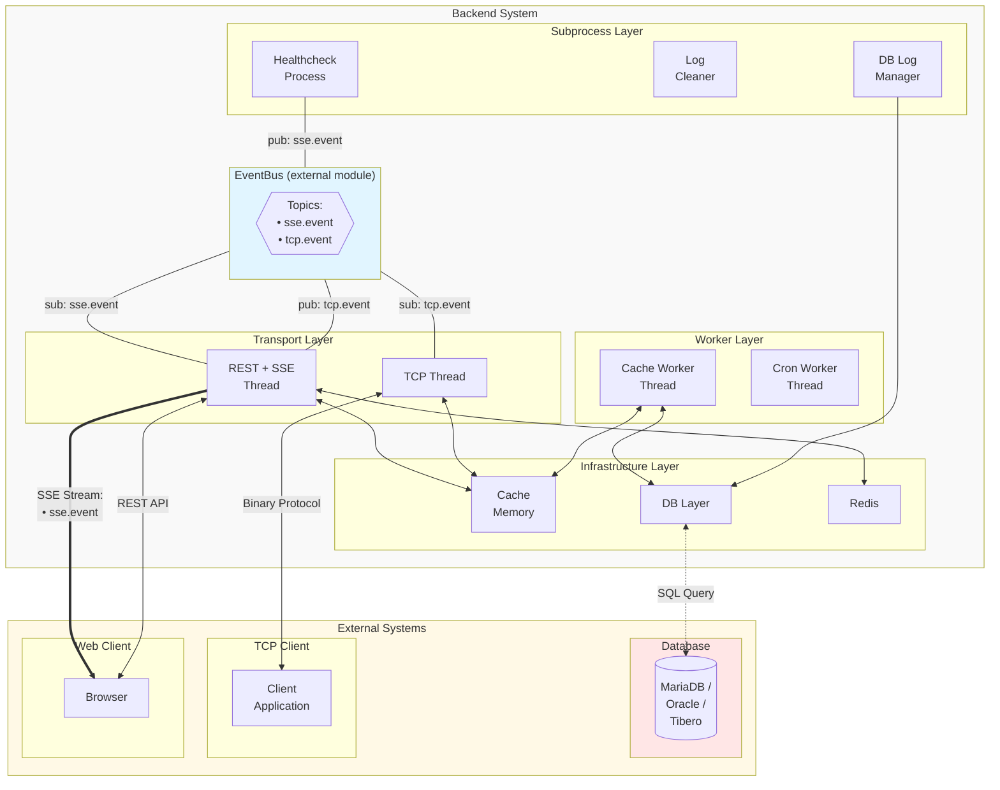

# app-folder-template

REST/SSE + TCP 이중 전송, 인메모리 캐시, 다중 DB 지원을 표준화한 Go 백엔드 애플리케이션 템플릿.
정식 구현은 `go/gin/` 참조. `go/gorilla/`는 deprecated.

## 폴더 구조

```
pjt/
├── cmd/
│   └── server/
│       ├── build/              # SPA 정적 파일 (프로덕션)
│       ├── spa-test/           # SPA 정적 파일 (개발용)
│       ├── log/
│       └── envfile_here.txt    # env.ini 생성 위치 표시
├── internal/
│   ├── app/                    # 애플리케이션 시작/종료 로직
│   ├── config/                 # 설정 로더 (env.ini)
│   ├── container/              # 의존성 주입 컨테이너
│   ├── event/                  # EventBus 전역 접근자 + 이벤트 타입 정의
│   │   └── event-define/
│   ├── healthcheck/            # DB·TCP 헬스체크 및 복구
│   ├── infra/
│   │   ├── cache/              # 인메모리 캐시
│   │   ├── object/             # 캐시 오브젝트 모델
│   │   └── define/
│   ├── logger/                 # 파일 기반 커스텀 로거 (일별 로테이션)
│   │   └── event-logger/       # DB 이벤트 로거
│   ├── model/                  # 도메인 모델
│   ├── redis/                  # Redis 클라이언트 래퍼
│   │   └── redis-model/
│   ├── db/
│   │   ├── db-handler/         # DB 추상화 인터페이스 + 드라이버 구현
│   │   │   ├── maria/
│   │   │   └── oracle/
│   │   └── entity/
│   ├── service/                # 비즈니스 로직
│   │   ├── api-service/
│   │   └── tcp-service/
│   ├── transport/
│   │   ├── http-rest/          # Gin HTTP 서버 + SSE
│   │   │   ├── controller/
│   │   │   ├── middleware/
│   │   │   ├── http-utils/
│   │   │   ├── request/
│   │   │   └── response/
│   │   └── tcp/                # 바이너리 프로토콜 TCP 서버
│   │       ├── server/
│   │       │   ├── client/
│   │       │   ├── controller/
│   │       │   ├── parser/
│   │       │   ├── serializer/
│   │       │   └── client-mock/
│   │       └── client/
│   ├── utils/
│   └── worker/                 # CacheWorker, CronWorker
└── docker_build.sh
```

## 커맨드

모든 명령은 `go/gin/`에서 실행.

**서버 실행** (`env.ini`, `log/`가 상대 경로로 해석되므로 반드시 `cmd/server/`에서 실행):

```bash
cd cmd/server && go run main.go
```

**바이너리 빌드:**

```bash
cd cmd/server && go build -o ./main main.go
```

**Docker 이미지 빌드:**

```bash
./docker_build.sh
```

**전체 테스트:**

```bash
go test ./...
```

**패키지별 테스트** (각 테스트 패키지도 `env.ini`를 상대 경로로 참조 — `envfile_here.txt`로 위치 확인):

```bash
go test ./internal/transport/http-rest/test/
go test ./internal/db/db-handler/test/
go test ./internal/service/test/
go test ./internal/logger/test/
```

## 설정

시작 시 워킹 디렉터리의 `env.ini`를 `go-ini`로 로드. `cmd/server/envfile_here.txt` → `cmd/server/env.ini`로 복사 후 값 입력.

`[DB] TYPE` 키로 드라이버 선택: `oracle`, `maria`, `mysql`, `postgres`, `tibero`

## 아키텍처


